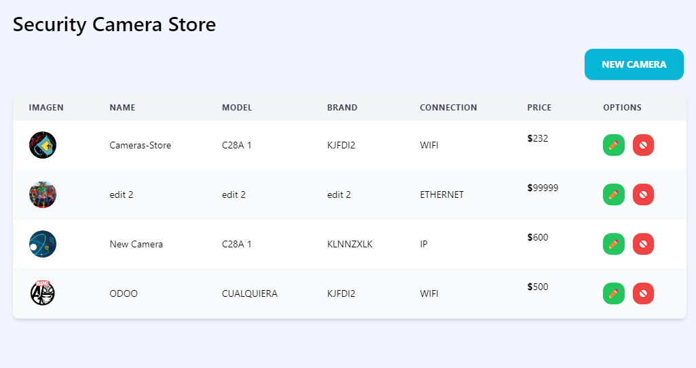
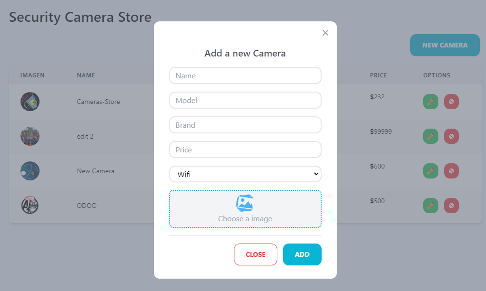
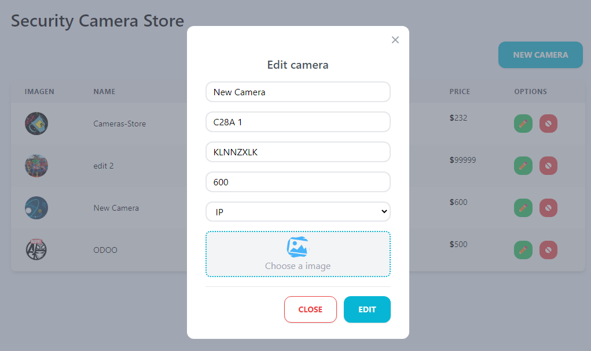

# React CRUD API with Typescript   

## Table of Content

- [About The Project](#about-the-project)
  - [Description](#description)
  - [Built With](#built-with)
- [Installation](#installation)
- [Usage](#usage)
- [Demo](#demo)
- [Contact](#contact)

## About The Project








## Description

This project is a complete CRUD of a camera store made with ReactJS, which I made to practice CRUD operations and make requests to a [REST API that I made with NodeJS and Typescript](https://github.com/josemiguel02/nodejs-express-ts-mongodb), also for the UI I used TailwindCSS.

## Built With

[](https://reactjs.org)

[](https://www.typescriptlang.org)

[](https://tailwindcss.com)

## Installation

1. Clone the repo and change "my-project" to your project name.

```sh
  git clone https://github.com/josemiguel02/react-crud-ts.git ./my-project
```

2. Go to the project directory

```sh
  cd my-project
```

3. Install NPM packages

```sh
  yarn install
```

## Usage

Run the project in development

```npm
  yarn dev
```

Build the project

```npm
  yarn build
```

## Demo

- [View demo](https://cameras-store.onrender.com)

## Contact

- Gmail - [josemidev24@gmail.com](mailto:josemidev24@gmail.com)
- Instagram - [@jmdp.02](https://www.instagram.com/jmdp.02)
